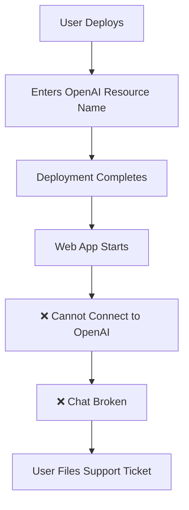
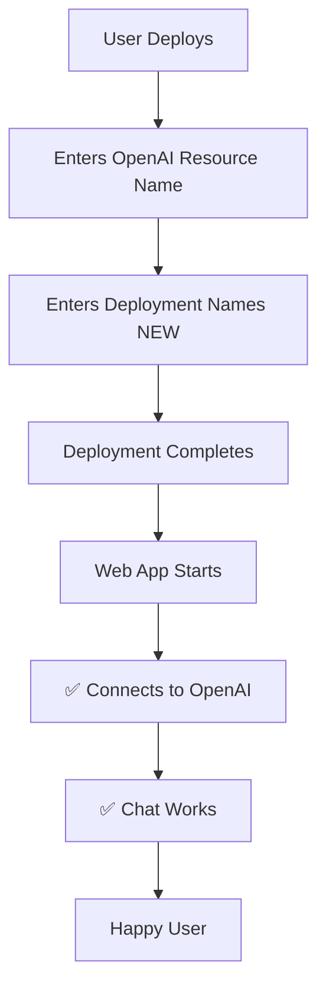

# Executive Summary - Critical ARM Template Bugs

**Date:** 2024-01-22  
**Status:** 🔴 CRITICAL - Immediate Action Required  
**Impact:** Deployment failures, Non-functional AI features

---

## 🚨 Critical Issues Identified

### Bug #1: Azure OpenAI Endpoint Generation Failure
**Severity:** 🔴 CRITICAL  
**Impact:** SmartLib cannot connect to Azure OpenAI - core functionality broken  
**Root Cause:** Missing UI input fields for deployment names

### Bug #2: Document Intelligence Validation Failure  
**Severity:** 🟡 HIGH  
**Impact:** Optional feature configuration always fails  
**Root Cause:** Incorrect API validation logic

---

## 📊 Quick Stats

| Metric | Value |
|--------|-------|
| Files Affected | 1 ([`createUiDefinition.json`](../catalog/createUiDefinition.json)) |
| Lines to Add | ~100 lines |
| Lines to Modify | ~60 lines |
| Breaking Changes | Yes (intentional - fixes critical bugs) |
| Estimated Fix Time | 30-60 minutes |
| Testing Time | 2-4 hours |

---

## 🎯 Recommended Actions

### Immediate (Today)
1. ✅ Review [`CRITICAL_BUGS_ANALYSIS.md`](CRITICAL_BUGS_ANALYSIS.md) - Detailed technical analysis
2. ✅ Implement fixes using [`BUGS_FIX_IMPLEMENTATION_GUIDE.md`](BUGS_FIX_IMPLEMENTATION_GUIDE.md)
3. ✅ Test in Azure Portal Sandbox

### Short-term (This Week)
4. ✅ Execute test suite from [`BUGS_TESTING_STRATEGY.md`](BUGS_TESTING_STRATEGY.md)
5. ✅ Deploy to test environment
6. ✅ Validate end-to-end functionality

### Medium-term (Before Production)
7. ✅ Update user documentation
8. ✅ Notify existing users of breaking changes
9. ✅ Deploy to production

---

## 🔍 What's Wrong?

### Bug #1 Explained (Azure OpenAI)

**User enters:**
- ✅ Azure OpenAI resource name: "my-openai"
- ✅ Auto-generated endpoint: https://my-openai.openai.azure.com

**User SHOULD enter but can't:**
- ❌ Chat model deployment name: (field missing!)
- ❌ Embedding model deployment name: (field missing!)

**Result:**
- SmartLib web app receives empty deployment names
- Cannot connect to Azure OpenAI models
- Chat functionality completely broken

### Bug #2 Explained (Document Intelligence)

**User enters:**
- Endpoint URL: https://my-doc-intel.cognitiveservices.azure.com/

**Validation attempts:**
- API call to: `/subscriptions/{id}/providers/.../accounts/my-doc-intel`
- ❌ Missing resource group in path!
- Azure cannot find resource without full path
- Validation always returns: "NOT FOUND"

**Result:**
- Users cannot configure Document Intelligence
- Manual validation workaround required
- Poor user experience

---

## ✅ Proposed Solutions

### Fix #1: Add Missing Input Fields (RECOMMENDED)

Add two new input fields in UI:
```
1. "Chat model deployment name" → TextBox input
2. "Embedding model deployment name" → TextBox input
3. Help text with instructions → InfoBox
```

**Benefits:**
- ✅ Collects required information
- ✅ Validates format
- ✅ Fixes critical bug
- ✅ Low complexity

**Drawbacks:**
- ⚠️ Breaking change (users must provide these values)
- ⚠️ Requires documentation update

### Fix #2: Replace with ResourceSelector (RECOMMENDED)

Replace TextBox validation with Azure ResourceSelector:
```
1. Checkbox: "Enable Document Intelligence"
2. ResourceSelector: Pick from existing resources
3. Auto-populate endpoint from selected resource
```

**Benefits:**
- ✅ Native Azure UI component
- ✅ Automatic validation
- ✅ Better UX (no manual typing)
- ✅ Zero validation errors
- ✅ Filters to correct resource type

**Drawbacks:**
- ⚠️ Slightly more complex implementation
- ⚠️ Requires resource to exist (already a requirement)

---

## 📈 Impact Analysis

### Before Fix



### After Fix



---

## 🔄 Implementation Plan

### Phase 1: Preparation (30 min)
- [ ] Backup current `createUiDefinition.json`
- [ ] Review all documentation
- [ ] Set up test environment
- [ ] Prepare test data (resource names, deployment names)

### Phase 2: Implementation (30-60 min)
- [ ] Implement Bug #1 fixes (add deployment name fields)
- [ ] Implement Bug #2 fixes (ResourceSelector)
- [ ] Validate JSON syntax
- [ ] Test in Azure Portal Sandbox

### Phase 3: Testing (2-4 hours)
- [ ] Execute Test Suite 1: JSON validation
- [ ] Execute Test Suite 2: Sandbox testing
- [ ] Execute Test Suite 3: Integration testing
- [ ] Execute Test Suite 4: Actual deployment
- [ ] Execute Test Suite 5: Regression testing

### Phase 4: Deployment (1 hour)
- [ ] Update production template
- [ ] Update documentation
- [ ] Notify users of update
- [ ] Monitor first deployments

**Total Time:** 4-7 hours (including comprehensive testing)

---

## 📚 Documentation Delivered

| Document | Purpose | Audience |
|----------|---------|----------|
| [`CRITICAL_BUGS_ANALYSIS.md`](CRITICAL_BUGS_ANALYSIS.md) | Detailed technical analysis | Senior engineers, architects |
| [`BUGS_FIX_IMPLEMENTATION_GUIDE.md`](BUGS_FIX_IMPLEMENTATION_GUIDE.md) | Step-by-step fix instructions | Developers |
| [`BUGS_TESTING_STRATEGY.md`](BUGS_TESTING_STRATEGY.md) | Comprehensive test plan | QA engineers, testers |
| [`BUGS_EXECUTIVE_SUMMARY.md`](BUGS_EXECUTIVE_SUMMARY.md) | High-level overview (this doc) | Management, stakeholders |

---

## ⚠️ Breaking Changes Notice

### What's Breaking

**Before:** Users could deploy without providing deployment names  
**After:** Users MUST provide:
- Chat model deployment name
- Embedding model deployment name

### Migration Path

**For new deployments:**
- Follow new UI prompts
- Provide deployment names from Azure OpenAI Studio

**For existing deployments:**
- Re-deploy with new template
- Provide deployment names during update
- Existing resources will be updated (not recreated)

### User Communication

**Email Template:**
```
Subject: SmartLib ARM Template Update Required

Dear SmartLib Users,

We've identified and fixed a critical bug that prevented proper Azure OpenAI configuration.

REQUIRED ACTION:
If you're planning a new deployment, you'll now need to provide:
1. Your Azure OpenAI chat model deployment name
2. Your Azure OpenAI embedding model deployment name

Find these in Azure OpenAI Studio → Deployments

This fix ensures SmartLib can properly connect to your Azure OpenAI resources.

Questions? Contact support@smartlib.id
```

---

## 🎯 Success Criteria

Deployment is successful when:

### Technical Validation
- [ ] JSON validates without syntax errors
- [ ] Sandbox test completes end-to-end
- [ ] Test deployment succeeds
- [ ] Environment variables contain deployment names
- [ ] Web app connects to Azure OpenAI
- [ ] Chat functionality returns AI responses

### User Validation
- [ ] User can select existing resources
- [ ] Validation messages are clear
- [ ] Error states are helpful
- [ ] Success path is straightforward

### Business Validation
- [ ] Support tickets for "OpenAI not connecting" decrease to zero
- [ ] Deployment success rate increases to >95%
- [ ] User satisfaction scores improve

---

## 🚀 Next Steps

### For Implementation Team

1. **Review** all documentation (estimated: 30 minutes)
2. **Implement** fixes following the guide (estimated: 60 minutes)
3. **Test** in sandbox environment (estimated: 30 minutes)
4. **Deploy** to test subscription (estimated: 2 hours)
5. **Validate** end-to-end functionality (estimated: 1 hour)

### For Management

1. **Approve** implementation plan
2. **Schedule** maintenance window (if needed)
3. **Communicate** to users about update
4. **Monitor** deployment metrics post-fix

### For Support Team

1. **Review** new UI fields and validation
2. **Update** troubleshooting guides
3. **Prepare** for user questions about new fields
4. **Monitor** support tickets after deployment

---

## 📞 Contacts & Resources

**Technical Questions:**
- Senior Azure Engineer: [Your Team]
- ARM Template Architect: [Your Team]

**Azure Documentation:**
- [CreateUIDefinition Elements](https://learn.microsoft.com/azure/azure-resource-manager/managed-applications/create-uidefinition-elements)
- [ResourceSelector Reference](https://learn.microsoft.com/azure/azure-resource-manager/managed-applications/microsoft-solutions-resourceselector)
- [Azure OpenAI Documentation](https://learn.microsoft.com/azure/ai-services/openai/)

**Project Resources:**
- ARM Template Repository: [`/ARMtemplate/catalog/`](../catalog/)
- Test Environment: [Azure Test Subscription]
- CI/CD Pipeline: [Your Pipeline]

---

## 🏁 Conclusion

Both bugs are well-understood, solutions are designed, and implementation is ready to proceed. The fixes are:

✅ **Low Complexity:** Add fields and replace validation logic  
✅ **High Impact:** Enables core functionality  
✅ **Well Documented:** Complete guides and test plans  
✅ **Production Ready:** After testing phase completion

**Recommendation:** Proceed with implementation immediately to restore full functionality.

---

**Document Version:** 1.0  
**Last Updated:** 2024-01-22  
**Status:** ✅ Ready for Implementation  
**Approvals Required:** Technical Lead, Product Owner