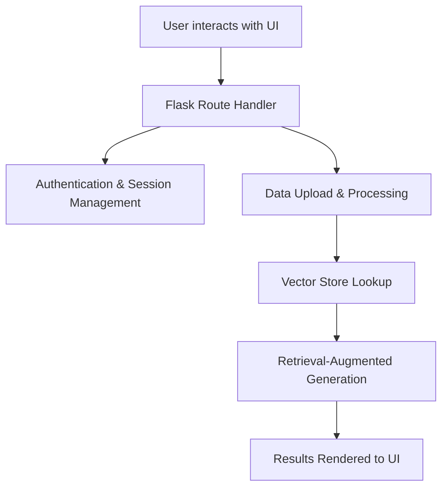

# Flask RAG - Retrieval Augmented Generation Application

Flask RAG is a web application built with Flask, designed to demonstrate a Retrieval-Augmented Generation (RAG) system. It integrates with different vector stores like ChromaDB and PGVector for fast similarity searches and provides a user-friendly interface to perform tasks such as user login, registration, data uploads, and interactive retrieval of generated results.

## Project Overview

This application is designed with a focus on user experience, ensuring intuitive navigation and a smooth interaction flow. The system leverages a vector store for efficient similarity searches, enabling rapid processing of uploaded data and delivering relevant augmented responses.

## Architecture and Workflow

The following diagram illustrates the high-level system architecture and the request-response process:



- **User Interactions:** Users navigate through the application via the web interface.
- **Flask Route Handler:** Incoming requests are managed by Flask endpoints defined in `app.py`.
- **Authentication & Session Management:** Secure login and registration processes ensure user data privacy.
- **Data Upload & Processing:** Users can upload data that is processed and indexed in the vector store.
- **Vector Store Lookup:** The system consults the vector store to perform similarity searches.
- **Retrieval-Augmented Generation:** Based on the vector store lookup, the system generates and augments the results.
- **Results Rendered to UI:** Final results are sent back to the user's browser for a seamless experience.

## Project Structure

Below is an updated breakdown of the project's file structure:

- **app.py**: Main Flask application file managing routes and core logic.
- **requirements.txt**: Lists the necessary Python packages and dependencies.
- **config.py**: Contains the configuration for the application, including the vector store provider.
- **modules/**: Contains the core logic of the application.
  - **vector_store_utils.py**: Contains the logic for interacting with the vector stores.
- **templates/**: HTML templates for rendering the web pages.
  - **base.html**: Base layout used by other pages.
  - **index.html**: Homepage for information and navigation.
  - **login.html**: User login interface.
  - **register.html**: Registration form for new users.
  - **upload.html**: Data upload page for triggering the vector store processing.

> **Note:** Ensure that your directory structure matches the above list. If additional directories (e.g., an instance folder) are used for configuration or runtime data, please adjust accordingly.

## Getting Started

### Prerequisites

- Python 3.7 or higher
- A Unix-like environment (Linux/macOS recommended)
- Virtual environment setup (highly recommended)

### Setup Instructions

1. **Clone the Repository**

   Clone the repository to your local machine.

2. **Setup Conda Environment**

   Create and activate a conda environment with Python 3.9 (or your preferred version):

   ```bash
   conda create -n flaskrag python=3.9 -y
   conda activate flaskrag
   ```

3. **Install Dependencies**

   With the virtual environment activated, install required packages:

   ```bash
   pip install -r requirements.txt
   ```

4. **Configure the Vector Store**

   The application can use either ChromaDB or PGVector as a vector store. The default is PGVector. To change the vector store provider, you need to set the `VECTOR_STORE_PROVIDER` environment variable in your `.env.dev` file.

   For ChromaDB:
   ```
   VECTOR_STORE_PROVIDER=chromadb
   ```

   For PGVector:
   ```
   VECTOR_STORE_PROVIDER=pgvector
   ```
   You will also need to configure the connection string for PGVector in the `.env.dev` file.

5. **Run the Application**

   Start the application by running:

   ```bash
   python app.py
   ```

   The app should now be active on port 5000 (or the port specified in your configuration).

## Testing the Application

To verify user experience elements and core functionalities:

- **Access the Web Interface:** Open your browser and navigate to `http://localhost:5000`.
- **User Registration & Login:** Test the authentication flow using the provided forms.
- **Data Upload:** Submit sample data on the upload page and verify that the vector store processing executes correctly.
- **Results Verification:** Review the rendered results to ensure the augmented generation meets expectations.

## Recommendations for Enhanced User Experience

- **Navigation Improvements:** Ensure all links and buttons are clearly labeled and easy to navigate.
- **Responsive Design:** Verify that the UI adapts to different screen sizes.
- **Feedback Mechanisms:** Implement messages or loaders during data processing for better user feedback.
- **Error Handling:** Provide clear, user-friendly error messages and guidance for remedial steps.

## Contributing

Contributions are welcome. Please fork the repository and submit pull requests for any enhancements or bug fixes.

## License

This project is open source and available under the [MIT License](LICENSE).

## Acknowledgments

- **Flask:** Robust web framework.
- **ChromaDB/PGVector:** Fast, efficient similarity search libraries.
- **Community Contributions:** Thanks to all contributors and open source supporters.