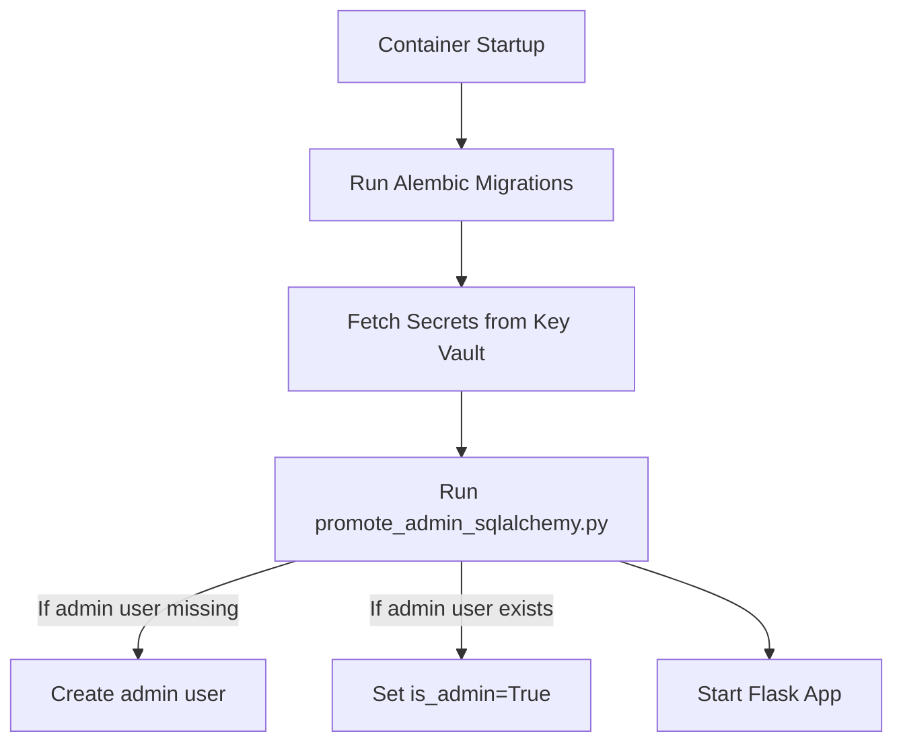

# Automated Admin Promotion & Secure Configuration for Azure Container Deployments

---

## 1. Problem Statement

When deploying the Flask RAG app in Azure containers, you need to ensure that an admin user is always present and promoted automatically on startup. Manual promotion (as done in local development) is not feasible or secure in production. Additionally, sensitive configuration (such as admin credentials) should be managed securely, ideally using Azure Key Vault.

---

## 2. Goals

- **Automate admin user promotion** on every container start, regardless of DB backend (SQLite, PostgreSQL, etc.).
- **Ensure idempotency**: safe to run multiple times, no duplicate users, no errors if already admin.
- **Support secure, flexible configuration** (admin username, password, etc.) using environment variables and/or Azure Key Vault.
- **Integrate with container startup**: run after migrations, before app server.
- **No disruption** to existing user management, admin toggling, or UI logic.

---

## 3. Solution Overview

### 3.1. Refactor Admin Promotion Script

- **Create a new script** (e.g., `promote_admin_sqlalchemy.py`) that:
  - Uses SQLAlchemy and your existing models/utilities (`modules/database.py`).
  - Looks up the admin user by username (default: "admin", or from env/Key Vault).
  - If found, sets `is_admin=True`.
  - If not found, creates the user with a secure password (from env/Key Vault, or generates one and logs it).
  - Logs all actions for auditability.
- **Idempotent**: Safe to run repeatedly.

### 3.2. Entrypoint Script for Container Startup

- **Create an entrypoint script** (e.g., `docker-entrypoint.sh`) that:
  1. Runs Alembic migrations: `alembic upgrade head`
  2. Runs the admin promotion script: `python promote_admin_sqlalchemy.py`
  3. Starts the Flask app (or Gunicorn): `python app.py` or `gunicorn ...`
- **Update Dockerfile** to use this entrypoint.

### 3.3. Secure Configuration with Azure Key Vault

- **Store sensitive values** (admin username, password, etc.) in Azure Key Vault.
- **On container startup**:
  - Use Azure SDK (e.g., `azure-identity`, `azure-keyvault-secrets`) to fetch secrets.
  - Set them as environment variables, or pass them directly to the promotion script.
- **Promotion script** reads from environment variables (populated from Key Vault) for admin credentials.

#### Example: Fetching Secrets in Entrypoint

```bash
# docker-entrypoint.sh (snippet)
export ADMIN_USERNAME=$(python get_secret.py --secret-name admin-username)
export ADMIN_PASSWORD=$(python get_secret.py --secret-name admin-password)
python promote_admin_sqlalchemy.py
```

- `get_secret.py` is a small Python script using Azure SDK to fetch secrets and print them.

---

## 4. Detailed Steps

### 4.1. promote_admin_sqlalchemy.py (Pseudocode)

```python
import os
from modules.database import db, get_user_by_username_local, create_user, set_user_admin
from flask import Flask
from extensions import db as db_ext

app = Flask(__name__)
# ... load config as needed ...
db_ext.init_app(app)

with app.app_context():
    username = os.environ.get("ADMIN_USERNAME", "admin")
    password = os.environ.get("ADMIN_PASSWORD", "secure-default-or-random")
    email = os.environ.get("ADMIN_EMAIL", None)

    user = get_user_by_username_local(username)
    if user:
        set_user_admin(user.user_id, True)
        print(f"User '{username}' promoted to admin.")
    else:
        # Optionally: generate a secure random password if not provided
        user = create_user(
            auth_provider="local",
            user_id=username,  # or generate a UUID
            username=username,
            email=email,
            password_hash=hash_password(password),
            is_admin=True
        )
        print(f"Admin user '{username}' created and promoted.")
```

- **Note:** Use a secure password hash function.
- **Idempotent:** If user exists, just promotes; if not, creates and promotes.

### 4.2. docker-entrypoint.sh (Pseudocode)

```bash
#!/bin/bash
set -e

# 1. Run migrations
alembic upgrade head

# 2. Fetch secrets from Azure Key Vault (if needed)
export ADMIN_USERNAME=$(python get_secret.py --secret-name admin-username)
export ADMIN_PASSWORD=$(python get_secret.py --secret-name admin-password)
export ADMIN_EMAIL=$(python get_secret.py --secret-name admin-email)

# 3. Promote admin user
python promote_admin_sqlalchemy.py

# 4. Start the app
exec python app.py  # or gunicorn ...
```

- **get_secret.py**: Uses Azure SDK to fetch secrets and print to stdout.

### 4.3. Azure Key Vault Integration

- **Store secrets** in Key Vault: `admin-username`, `admin-password`, `admin-email`.
- **Grant container access** to Key Vault (via managed identity or service principal).
- **Use Azure SDK** in `get_secret.py` to fetch secrets at runtime.

#### Example get_secret.py

```python
from azure.identity import DefaultAzureCredential
from azure.keyvault.secrets import SecretClient
import sys
import os

vault_url = os.environ["AZURE_KEYVAULT_URL"]
secret_name = sys.argv[2]
credential = DefaultAzureCredential()
client = SecretClient(vault_url=vault_url, credential=credential)
secret = client.get_secret(secret_name)
print(secret.value)
```

---

## 5. Security Considerations

- **Never hardcode secrets** in code or Docker images.
- **Use Key Vault** for all sensitive values.
- **Restrict Key Vault access** to only the container's managed identity.
- **Log admin creation/promotion** for audit, but never log plaintext passwords.

---

## 6. Impact & Compatibility

- **No changes** to user management, admin toggling, or UI logic.
- **Works with any DB backend** supported by SQLAlchemy.
- **Safe to run on every container start** (idempotent).
- **Easily extended** to support multiple admin users or other roles.

---

## 7. Visual Summary



---

## 8. Next Steps

- Review this document and confirm the approach.
- Decide on admin username/email/password policy.
- If approved, I can provide:
  - Example scripts (`promote_admin_sqlalchemy.py`, `get_secret.py`, `docker-entrypoint.sh`)
  - Dockerfile changes
  - Key Vault setup instructions

---
