# Dataflow Diagram Document for Azure Marketplace

## 1. Introduction

This document provides detailed dataflow diagrams illustrating how information moves through the SmartLib application. These diagrams help visualize the system architecture, component interactions, and data processing flows.

## 2. System Overview Dataflow

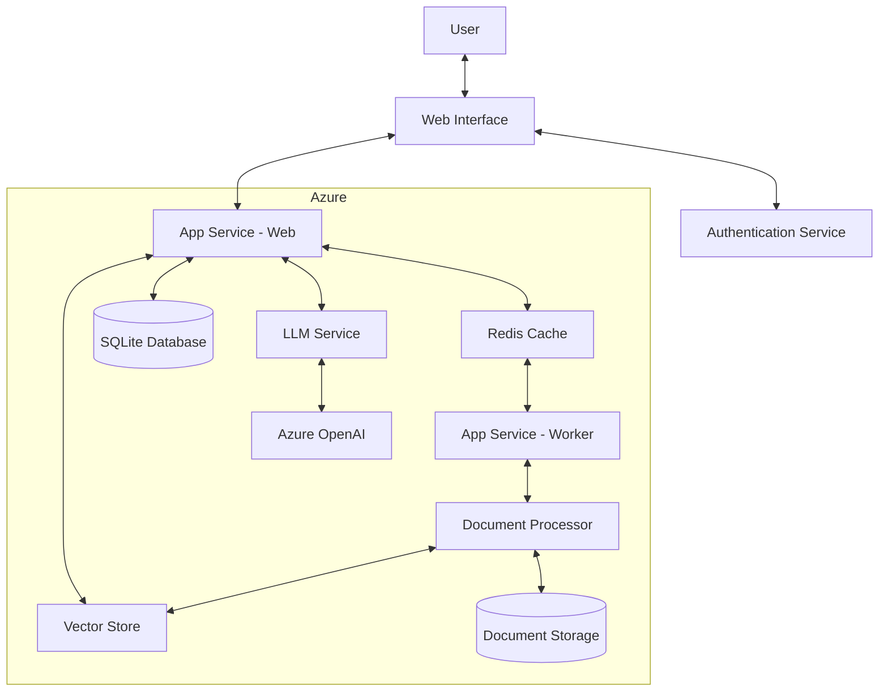

## 3. Authentication Flow

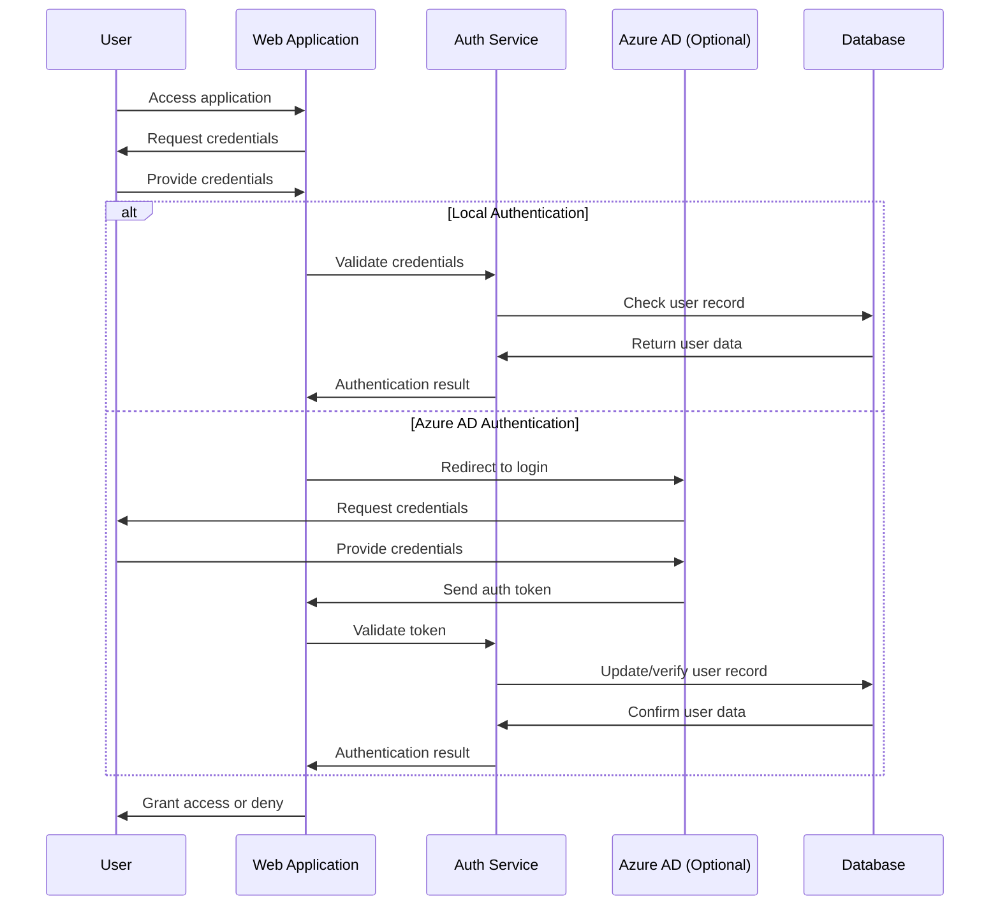

## 4. Document Upload and Processing Flow

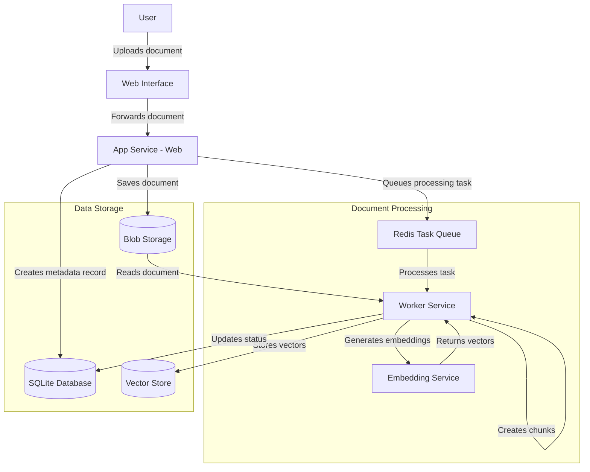

## 5. Search and Retrieval Flow

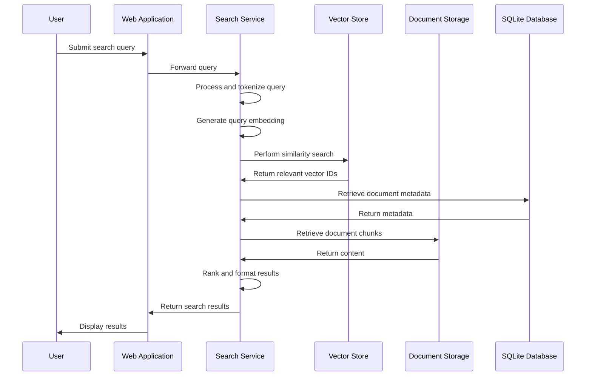

## 6. Chat Interaction Flow

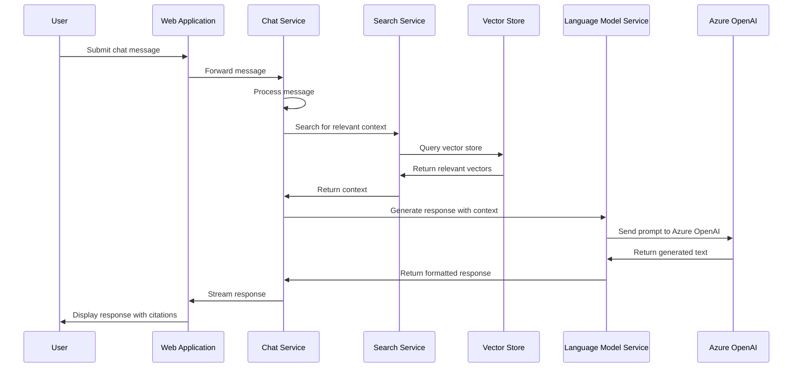

## 7. User Management Flow

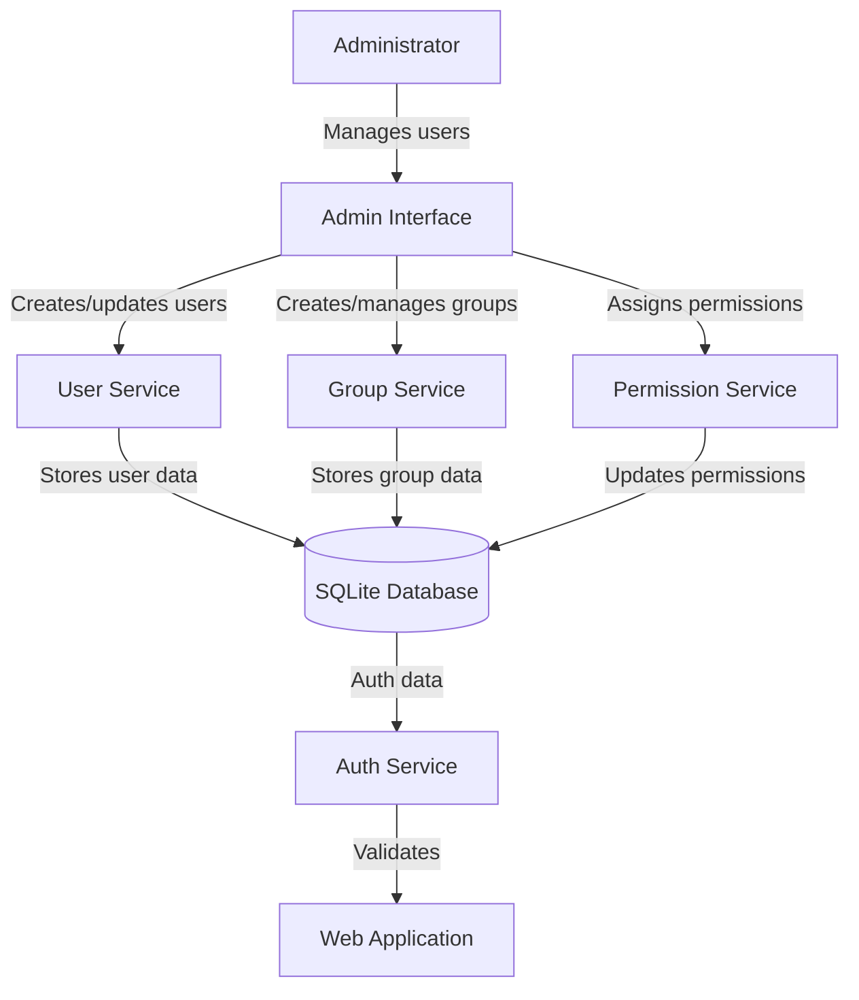

## 8. Default Deployment Architecture (ChromaDB)

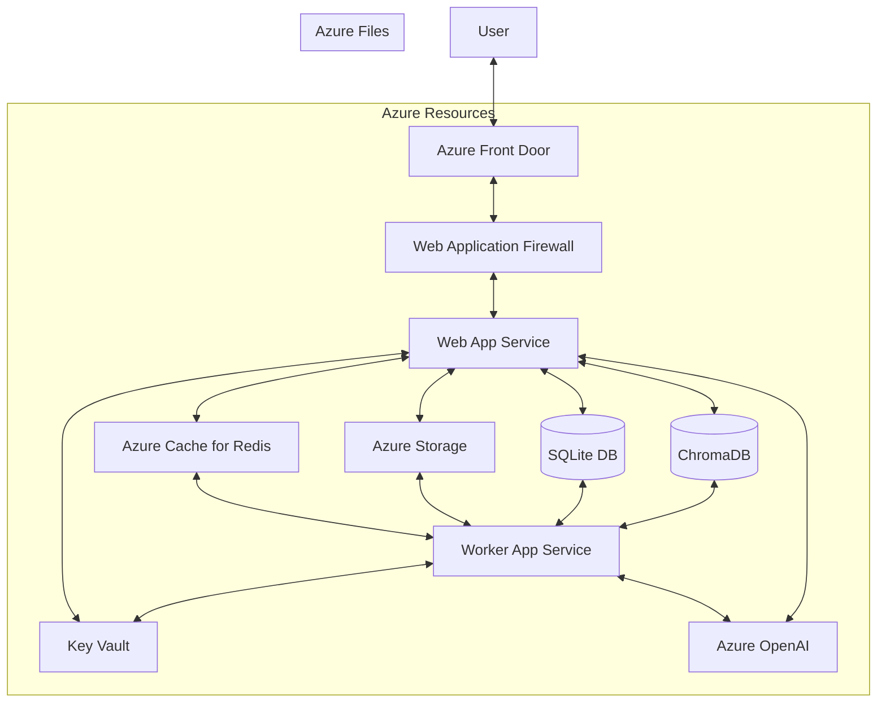

## 9. Optional PGVector Deployment Architecture

## 10. Split Architecture Model

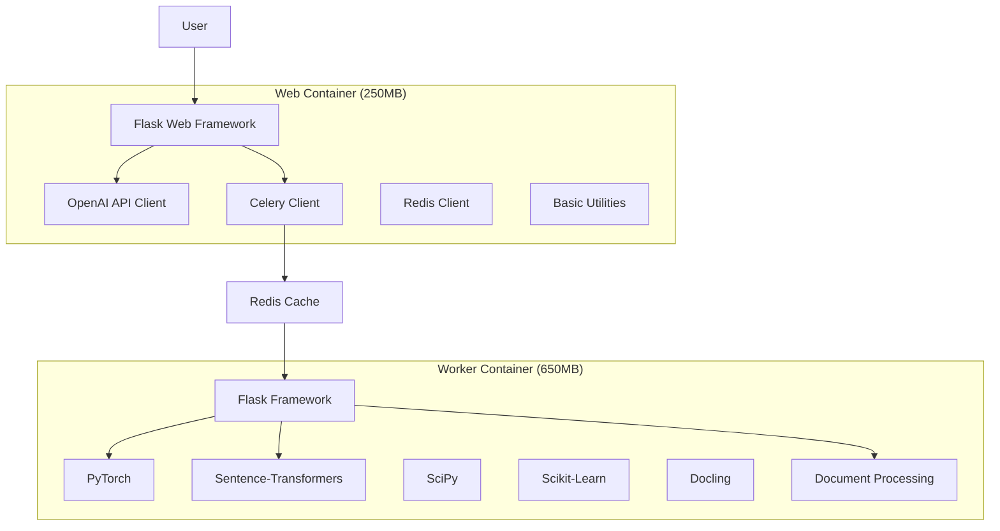

## 11. Azure Resource Deployment Model

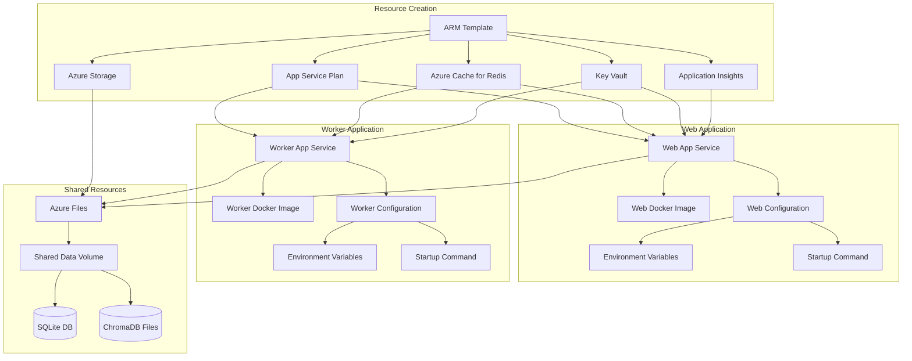

## 12. Cost-Optimized Shared Plan Architecture

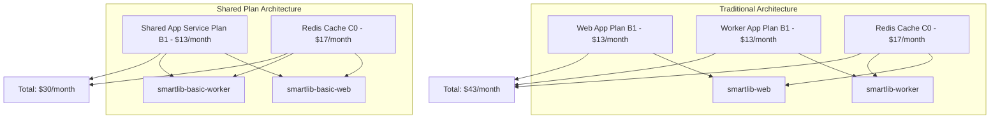

## 13. Vector Store Provider Options

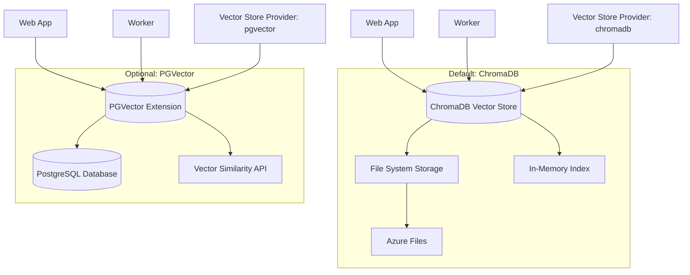

## 14. Conclusion

These dataflow diagrams illustrate the key components, interactions, and data movement patterns within the SmartLib application. They provide a visual reference to understand the system architecture, deployment model, and resource interactions when deployed to Azure through the Azure Marketplace.

The diagrams highlight the following key aspects:
- The default deployment uses SQLite as the database and ChromaDB as the vector store, both stored on Azure Files
- An optional configuration allows using PostgreSQL with PGVector for the vector store
- The split architecture approach separates web and worker responsibilities
- The cost-optimized shared plan option reduces costs while maintaining functionality
- The various data processing flows that enable the core RAG functionality of the application
