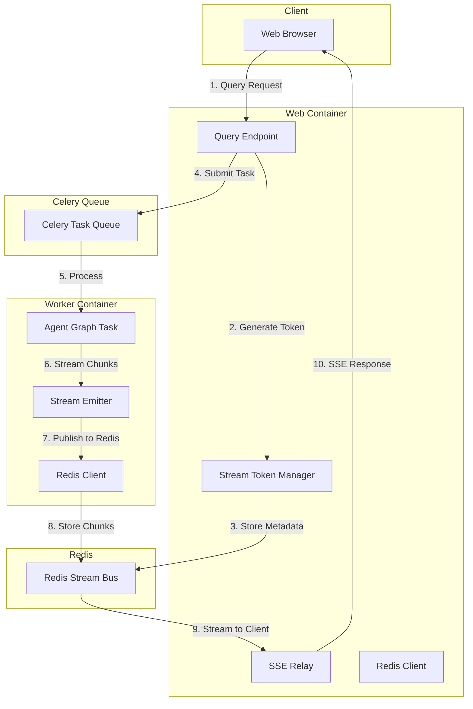
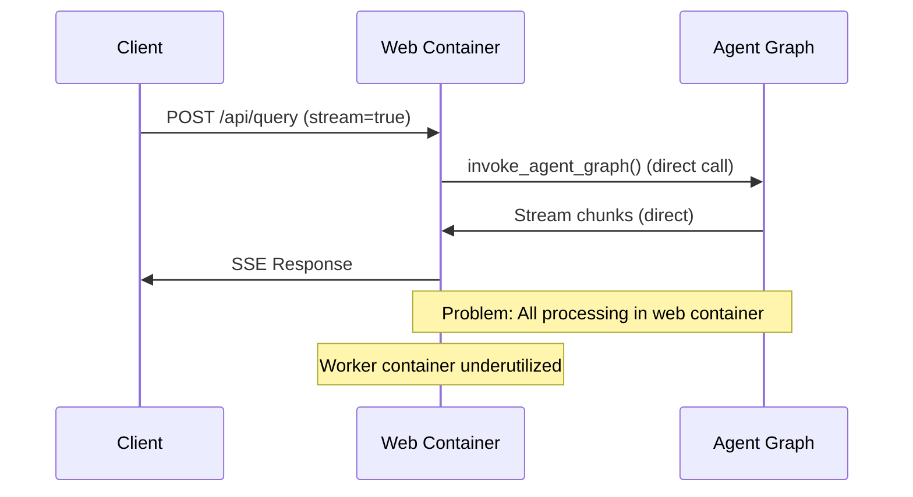
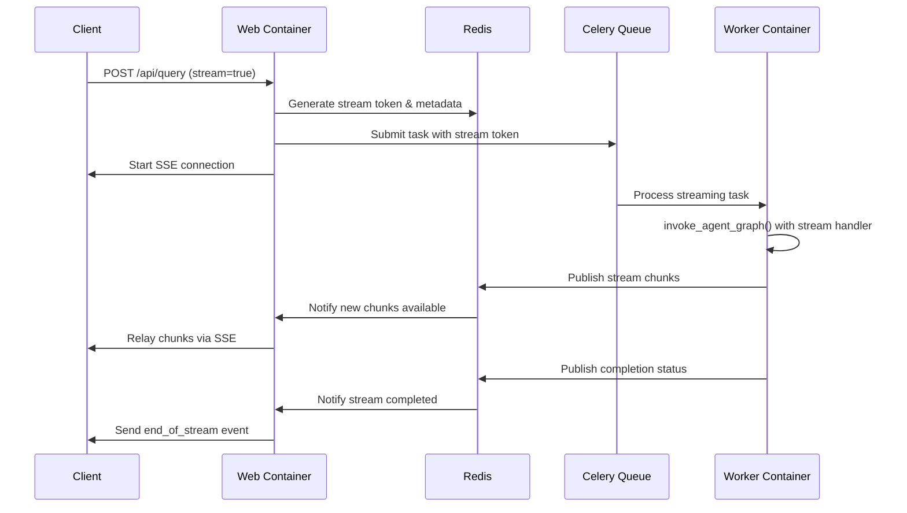

# SmartLib Streaming Pipeline Implementation Plan

## Architecture Overview



## Current vs Proposed Flow Comparison

### Current Streaming Flow (Problematic)


### Proposed Streaming Flow (Solution)


## Implementation Components

### 1. Stream Manager Module (`modules/stream_manager.py`)

**Purpose**: Centralized stream token and lifecycle management

**Key Functions**:
- `generate_stream_token()` - Creates unique tokens and Redis structures
- `validate_stream_token()` - Verifies token validity and access
- `update_stream_status()` - Updates stream state in Redis
- `cleanup_stream()` - Removes expired or completed streams

**Redis Operations**:
```python
# Token generation
token = str(uuid4())
redis_client.setex(f"stream:{token}:status", 3600, "initializing")
redis_client.hset(f"stream:{token}:metadata", {
    "user_id": user_id,
    "conversation_id": conversation_id,
    "created_at": datetime.utcnow().isoformat()
})

# Status updates
redis_client.set(f"stream:{token}:status", "processing")

# Cleanup
redis_client.delete(f"stream:{token}")
redis_client.delete(f"stream:{token}:metadata")
redis_client.delete(f"stream:{token}:status")
```

### 2. Enhanced Celery Tasks (`modules/agent_tasks.py`)

**New Task**: `invoke_agent_graph_stream_task`

**Key Features**:
- Accepts stream token parameter
- Uses custom stream handler to publish to Redis
- Handles stream status updates
- Error handling with Redis notification

**Stream Handler**:
```python
def redis_stream_handler(stream_token: str):
    """Returns a function that handles streaming chunks."""
    def handler(chunk_event):
        chunk_data = json.dumps(chunk_event)
        redis_client.rpush(f"stream:{stream_token}", chunk_data)
        redis_client.expire(f"stream:{stream_token}", 3600)
        
        # Update status for special events
        if chunk_event.get("type") == "end_of_stream":
            update_stream_status(stream_token, "completed")
        elif chunk_event.get("type") == "error":
            update_stream_status(stream_token, "error")
    
    return handler
```

### 3. Modified Agent Graph (`modules/agent.py`)

**Enhancement**: Add stream_handler parameter to `invoke_agent_graph`

**Changes**:
- Accept optional `stream_handler` function
- Modify `_collect_stream_chunks` to use custom handler
- Maintain backward compatibility

**Implementation**:
```python
def invoke_agent_graph(
    # ... existing parameters ...
    stream_handler: Optional[Callable] = None,
    **kwargs
):
    # ... existing code ...
    
    if stream:
        if stream_handler:
            # Use custom stream handler (Redis)
            return _collect_stream_chunks_with_handler(
                graph_to_invoke, initial_state, streaming_config, stream_handler
            )
        else:
            # Default behavior (direct streaming)
            return _collect_stream_chunks(graph_to_invoke, initial_state, streaming_config)
```

### 4. SSE Relay (`modules/query.py`)

**New Function**: `stream_from_redis`

**Features**:
- Subscribes to Redis stream for given token
- Relays chunks to client via SSE
- Handles client disconnection
- Automatic cleanup

**Implementation**:
```python
def stream_from_redis(stream_token: str):
    """Generator that relays Redis stream chunks to SSE."""
    if not validate_stream_token(stream_token):
        yield _serialize_error_event("Invalid or expired stream token")
        return
    
    update_stream_status(stream_token, "streaming")
    
    try:
        last_index = 0
        while True:
            # Get new chunks from Redis list
            chunks = redis_client.lrange(f"stream:{stream_token}", last_index, -1)
            
            for chunk in chunks:
                chunk_data = json.loads(chunk)
                yield f"data: {chunk}\n\n"
                last_index += 1
                
                if chunk_data.get("type") == "end_of_stream":
                    return
            
            # Check stream status
            status = get_stream_status(stream_token)
            if status in ["completed", "error", "cancelled"]:
                break
                
            time.sleep(0.01)  # Prevent busy loop
            
    except GeneratorExit:
        update_stream_status(stream_token, "cancelled")
    finally:
        schedule_cleanup(stream_token)
```

### 5. Modified Query Endpoint

**Changes to `/api/query`**:
- Generate stream token for streaming requests
- Submit task to Celery with token
- Use SSE relay instead of direct streaming

**Implementation**:
```python
if stream_flag:
    # Generate stream token
    stream_token = generate_stream_token(current_user.user_id, conversation_id)
    
    # Submit streaming task to Celery
    task_id = submit_agent_streaming_task(
        query=query_text,
        chat_history=chat_history_messages,
        vector_store_config=vector_store_config,
        stream_token=stream_token,
        # ... other parameters
    )
    
    # Return SSE response that relays from Redis
    return Response(
        stream_with_context(stream_from_redis(stream_token)),
        status=200,
        headers={
            "Content-Type": "text/event-stream",
            "X-Stream-Token": stream_token,
            "Cache-Control": "no-cache",
            "Connection": "keep-alive"
        },
        mimetype="text/event-stream",
    )
```

## Redis Data Model

### Key Structure

| Key Pattern | Type | Purpose | TTL |
|-------------|------|---------|-----|
| `stream:{token}` | List | Ordered stream chunks | 1 hour |
| `stream:{token}:metadata` | Hash | Stream metadata | 1 hour |
| `stream:{token}:status` | String | Current stream status | 1 hour |
| `stream:{token}:last_index` | String | Last processed index (for SSE relay) | 1 hour |

### Status Values

- `initializing` - Token created, task not yet started
- `processing` - Task picked up by worker
- `streaming` - Actively streaming to client
- `completed` - Stream finished successfully
- `error` - Stream failed with error
- `cancelled` - Client disconnected or cancelled

## Error Handling Strategy

### 1. Worker Side Errors
```python
try:
    # Agent graph execution
    result = invoke_agent_graph(...)
except Exception as e:
    # Publish error to Redis
    error_event = {
        "type": "error",
        "message": str(e),
        "status_code": 500
    }
    stream_handler(error_event)
    update_stream_status(stream_token, "error")
```

### 2. Client Disconnection
```python
def stream_from_redis(stream_token: str):
    try:
        # Streaming logic
        yield chunks...
    except GeneratorExit:
        # Client disconnected
        update_stream_status(stream_token, "cancelled")
        # Worker will continue processing but results won't be delivered
        # Consider adding cancellation signal to worker
```

### 3. Timeout Handling
```python
# Stream tokens have TTL of 1 hour
# Background cleanup task removes expired streams
def cleanup_expired_streams():
    pattern = "stream:*:status"
    for key in redis_client.scan_iter(match=pattern):
        if redis_client.ttl(key) == -1:  # No TTL set
            redis_client.expire(key, 3600)  # Set 1 hour TTL
```

## Testing Strategy

### 1. Unit Tests
- Stream token generation and validation
- Redis operations (set, get, expire)
- Stream status transitions
- Error handling scenarios

### 2. Integration Tests
- End-to-end streaming flow
- Worker container processing
- Redis pub/sub functionality
- Client disconnection handling

### 3. Load Tests
- Multiple concurrent streams
- High-volume streaming
- Redis memory usage
- Worker container load distribution

### 4. Failure Scenarios
- Worker container crash
- Redis connection failure
- Network interruption
- Client timeout

## Deployment Considerations

### 1. Redis Configuration
```yaml
# docker-compose.yaml additions
redis:
  image: redis:7-alpine
  ports:
    - "6379:6379"
  volumes:
    - redis_data:/data
  command: redis-server --maxmemory 512mb --maxmemory-policy allkeys-lru
```

### 2. Environment Variables
```bash
# Stream settings
STREAM_TIMEOUT=3600  # 1 hour
STREAM_CLEANUP_INTERVAL=300  # 5 minutes
MAX_CONCURRENT_STREAMS=100

# Redis settings
REDIS_URL=redis://redis:6379/0
REDIS_STREAM_DB=0
```

### 3. Monitoring
- Stream count and status metrics
- Redis memory usage
- Worker task queue length
- Stream duration and completion rates

## Migration Plan

### Phase 1: Foundation (Week 1)
1. Create stream manager module
2. Implement Redis utilities
3. Add stream token generation

### Phase 2: Worker Integration (Week 2)
1. Enhance Celery tasks for streaming
2. Modify agent graph for custom stream handlers
3. Implement Redis stream emission

### Phase 3: Web Integration (Week 3)
1. Implement SSE relay
2. Modify query endpoint
3. Add error handling and cleanup

### Phase 4: Testing & Deployment (Week 4)
1. Comprehensive testing
2. Performance optimization
3. Documentation updates
4. Azure deployment validation

## Rollback Strategy

If issues arise during deployment:
1. Feature flag to disable Redis streaming
2. Fallback to direct streaming in web container
3. Gradual rollout with percentage-based traffic splitting
4. Monitoring and alerting for quick detection

## Success Metrics

1. **Load Distribution**: 70% of streaming processing moved to workers
2. **Response Time**: No degradation in streaming latency
3. **Error Rate**: <1% increase in streaming errors
4. **Resource Usage**: 30% reduction in web container CPU usage
5. **Scalability**: Support 2x concurrent streaming requests